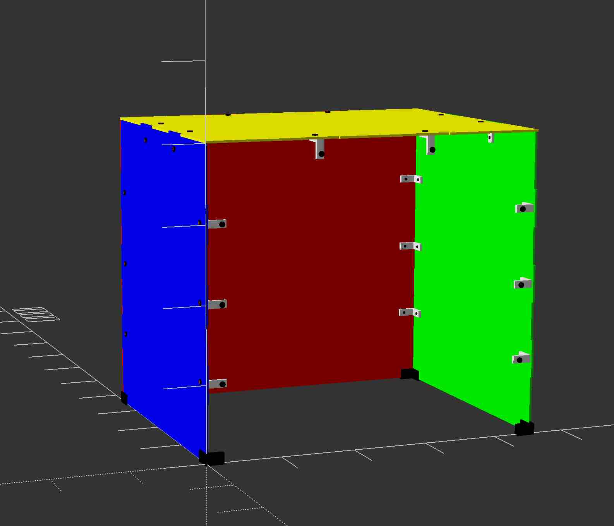
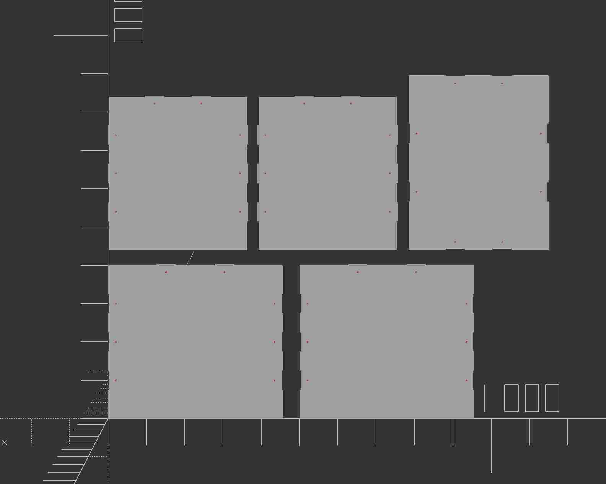

# Parametric Acrylic Dust Cover for 3D Printer

> [!WARNING]
> This is not meant to enclose an active 3D printer! There isn't any kind of ventilation in this design.
> This is merely a dust cover for when the printer is inactive.

> [!WARNING]
> This is a work in progress, and is not ready for use!

> [!WARNING]
> My Prusa MINI+ has a bunch of extra accessories installed, so the size of this box is much larger than the "normal" Prusa MINI+ footprint.

> [!WARNING]
> Currently, `$fn = 20;` for fast rendering during development. Increase this before creating output files for production.

## Introduction

I wanted to keep my Prusa MINI+ 3D printer safe from dust, while still keeping it visible.

For this reason I designed a box that can be laser-cut from transparent acrylic panels. 

The OpenSCAD design is parameteric, meaning that you can simply change some parameters (e.g. the size), and the code will generate a box that meets your requirements.

## Features

* Metal brackets and screws for solid construction.
* Panels slot together for additional rigidity ("tabbed edges").
* Corner braces at the bottom, to avoid cracking the acrylic panels.

## BOM

* 5 x panels, generated from included OpenSCAD code (cut from for instance acrylic or MDF)
* 20 x M4 Screws, 8mm
* 20 x metal L-shaped corner brackets
* 4 x corner braces
  * either 3D printed from the provided model
  * or can be bought as "silicon fish tank corner protector"

## How to use

Open `main.scad` in OpenSCAD. The most important parameters to edit are:

```
// inner box size
box_depth = 360;
box_height = 400;
box_width = 450;
```

Note that these are the inside dimensions of the desired box, so the final result will be slightly larger, depending on `panel_thickness`.

Use the `assemble()` method to get a 3D preview of the box. Use the `render_2d()` for a 2D view that can be used to generate a flat layout for laser cutting or similar. 

## Result

3D view (color scheme for debugging purposes):



Flat layout:



## TODO:

* hole for cable exit?
* handle to lift cover?
